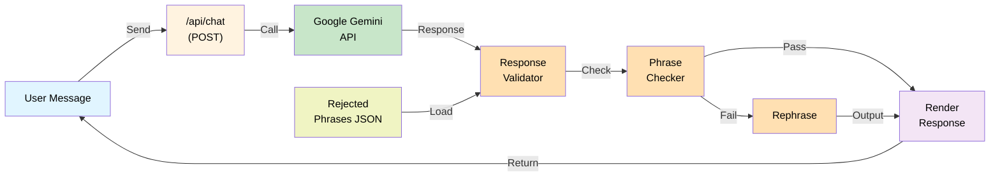

# Application Architecture

## Overview

This is an isomorphic Next.js application that functions as a ChatGPT clone with deterministic response cleaning. The architecture consists of a frontend UI layer, API routes for backend logic, integration with the Google Gemini API (gemini-2.5-flash), and a response validation pipeline.

## System Architecture Diagram



## Component Details

### API Endpoint
- **POST /api/chat** - Main entry point
  - Receives user message
  - Calls Google Gemini API
  - Pipes response through validator
  - Returns cleaned response

### Response Validation Pipeline
1. **Phrase Checker** - Detects hedging/defensive language
   - Loads rejected phrases from JSON config
   - Scans response text for matches
   - Identifies flagged phrases

2. **Filtering Logic**
   - **Pass**: Response contains no flagged phrases → render as-is
   - **Fail with pure filler**: Strip out defensive phrase
   - **Fail with useful content**: Rephrase response while keeping useful parts

3. **Response Rephrase** (AI-assisted)
   - Removes purely defensive filler
   - Preserves substantive content
   - Maintains natural language flow

### Configuration
- **rejected-phrases.json** - Centralized list of hedging phrases to detect and clean

### Data Flow
```
User Message → /api/chat → Google Gemini API → Response Validator → 
Phrase Checker → [Pass/Fail] → Response Rephrase (if needed) → Rendered Response → User
```

## Technology Stack
- **Framework**: Next.js (App Router)
- **AI API**: Google Gemini (`gemini-3.6-flash`)
- **Styling**: CSS Modules
- **Config**: JSON files
- **Deployment**: Vercel (recommended)

## Future Enhancements
- Message streaming for better UX
- Customizable phrase rules
- Analytics on phrase detection rates
- Confidence scoring for phrase categorization
